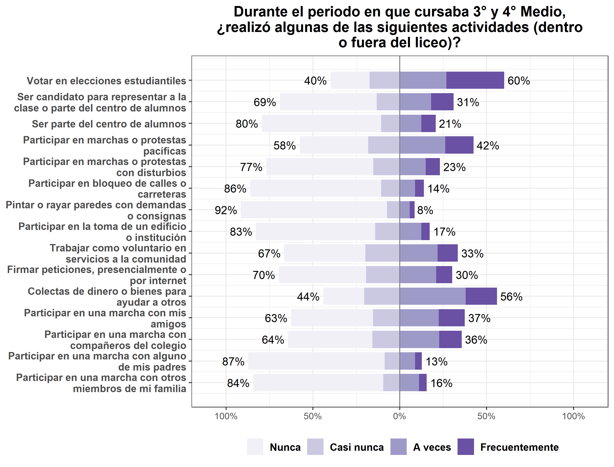
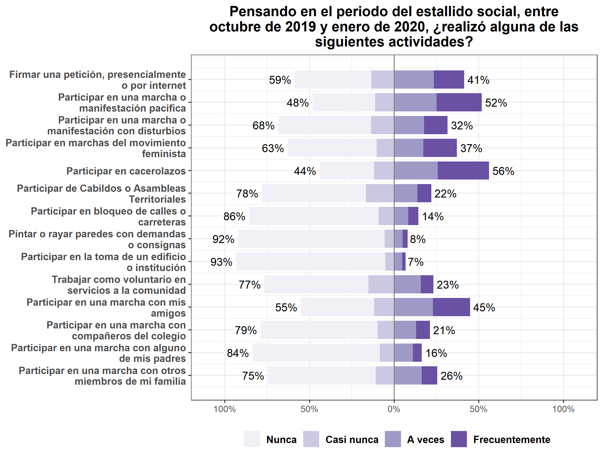
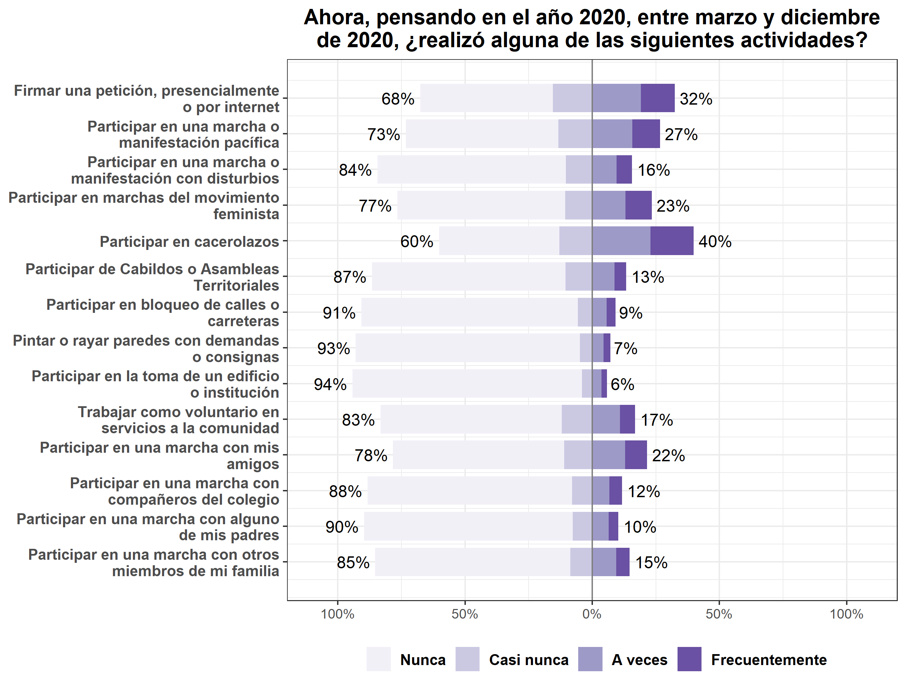
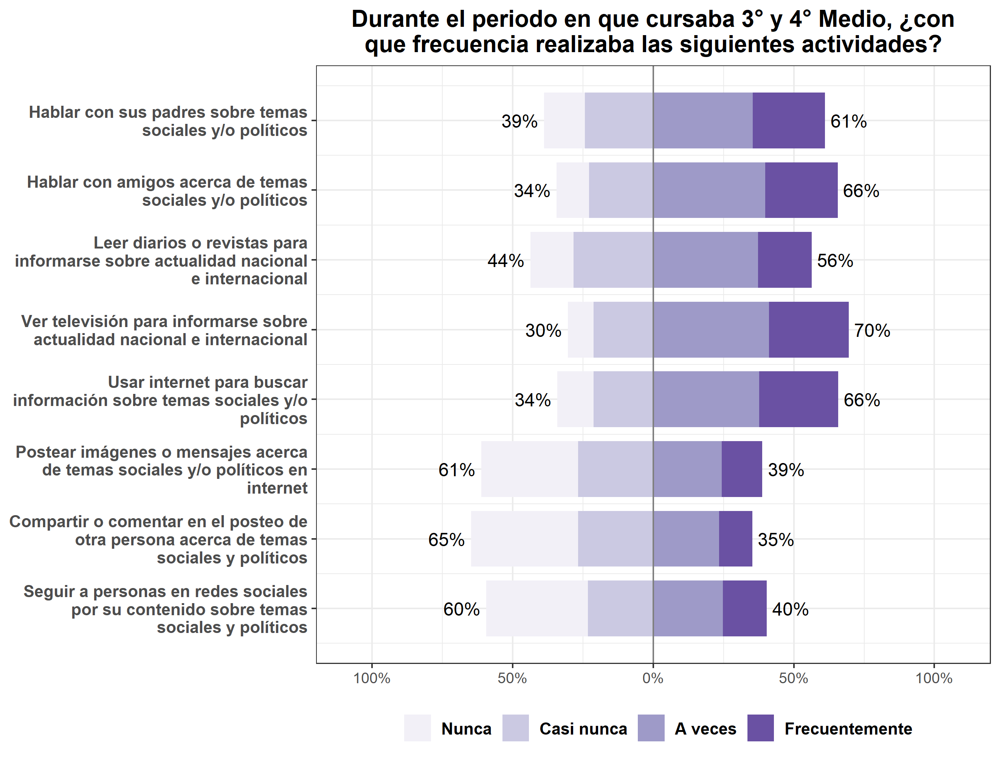
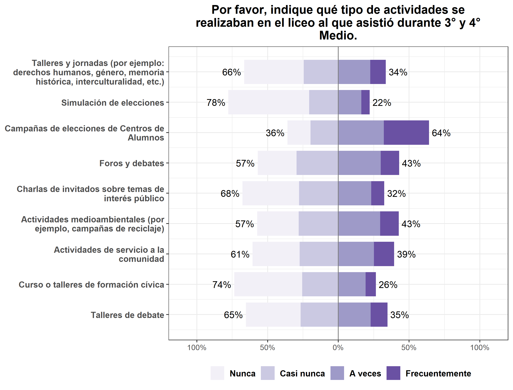
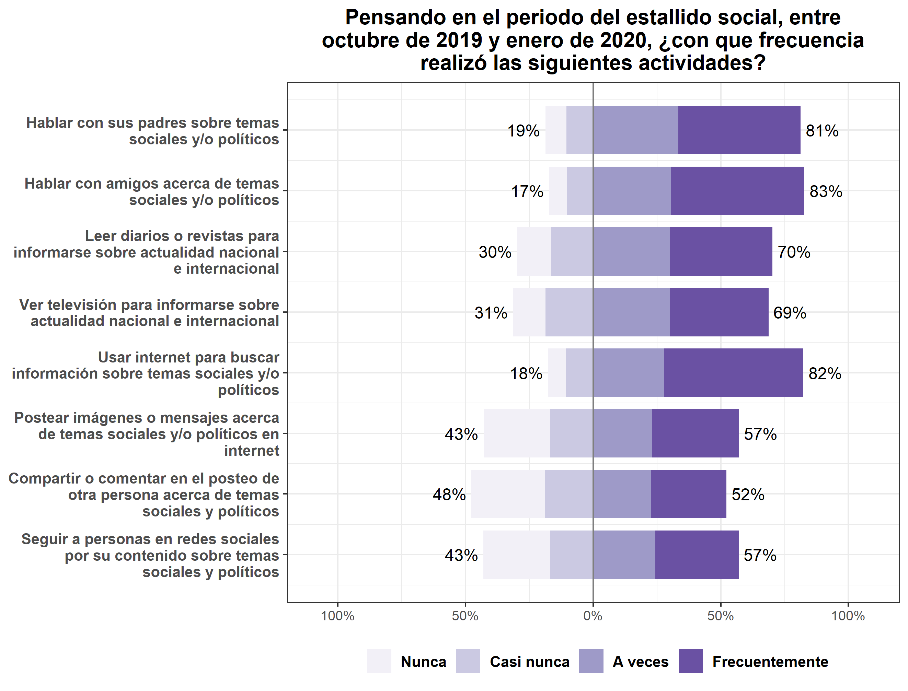
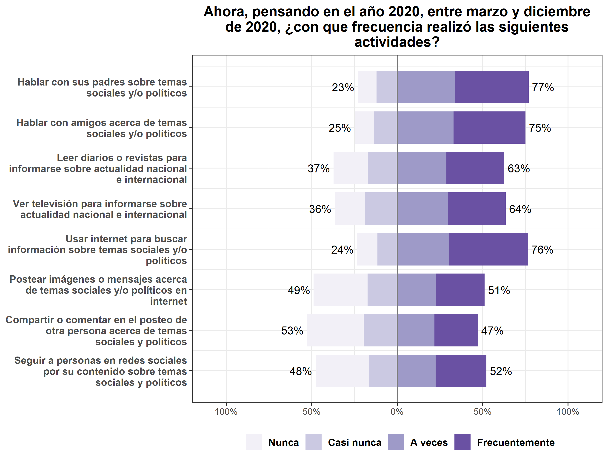

```{r echo=FALSE}
knitr::opts_chunk$set(out.width="80%", fig.pos = "!ht", out.extra = "") 
```

# Análisis descriptivo de las variables principales

La primera ola del estudio **Panel de Participación Ciudadana Juvenil** incorpora tres baterías de preguntas sobre participación ciudadana (correspondientes a las variables dependientes del estudio) y cuatro baterías de preguntas sobre prácticas de socializacción política. En esta sección se presentan gráficos descriptivos de estas baterías.

## Participación ciudadana

```{r echo=FALSE, fig.align='center', fig.cap="Participación ciudadana 3ro y 4to medio"}

```

---

```{r echo=FALSE, fig.align='center', fig.cap="Participación ciudadana durante el estallido social"}

```

---

```{r echo=FALSE, fig.align='center', fig.cap="Participación ciudadana durante el 2020"}

```

---

## Prácticas de socialización política

```{r echo=FALSE, fig.align='center', fig.cap="Socialización política durante 3ro y 4to medio"}

```

---


```{r echo=FALSE, fig.align='center', fig.cap="Socialización política en la escuela"}

```

---


```{r echo=FALSE, fig.align='center', fig.cap="Socialización política durante el estallido social"}

```

---


```{r echo=FALSE, fig.align='center', fig.cap="Socialización política durante el 2020"}

```

---